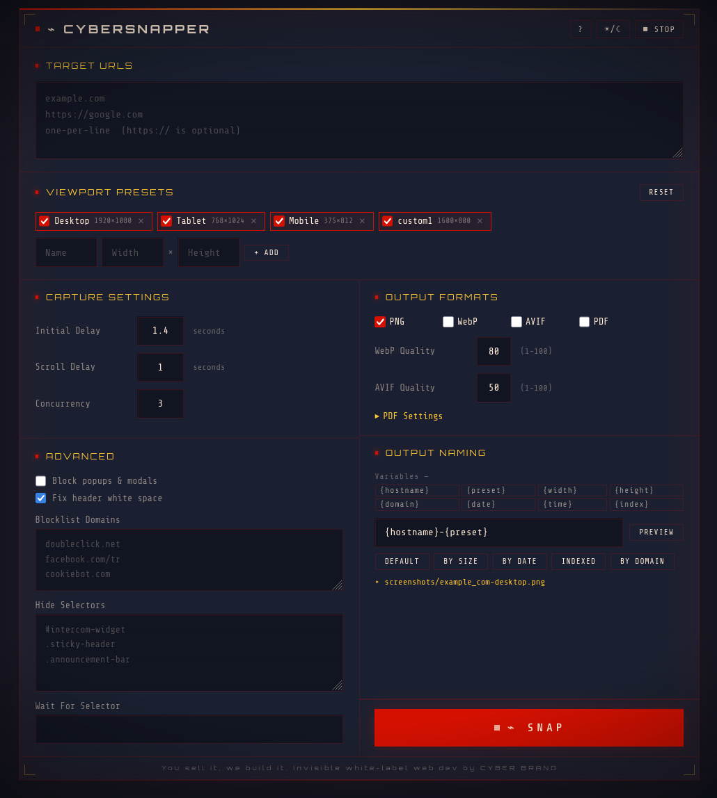
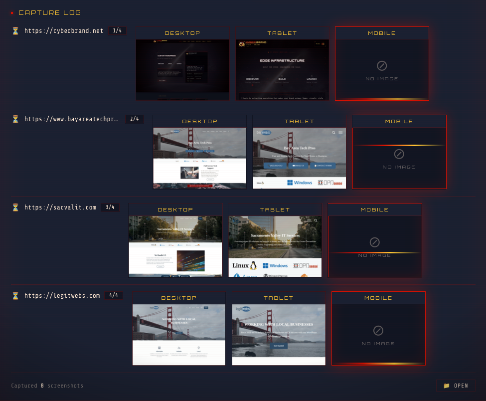

<p align="center">
  <h1 align="center">⌁ CyberSnapper</h1>
  <p align="center">
    Full-page screenshots at multiple viewports — CLI <em>and</em> Web UI
    <br>
    Powered by Playwright
  </p>
  <p align="center">
    <a href="https://cyberbrand.net/cybersnapper/">🌐 Plugins Homepage</a>
    •
    <a href="#features">Features</a>
    •
    <a href="#quick-start">Quick Start</a>
    •
    <a href="#cli-usage">CLI Usage</a>
    •
    <a href="#web-ui">Web UI</a>
    •
    <a href="#configuration">Configuration</a>
    •
    <a href="#build">Build</a>
  </p>
</p>

## Features

`📸 Full-page` &nbsp; `🎯 Desktop·Tablet·Mobile` &nbsp; `🌐 Web UI` &nbsp; `🖥️ CLI` &nbsp; `📄 PDF` &nbsp; `🖼️ WebP/AVIF` &nbsp; `⚡ Live progress` &nbsp; `🕒 Adjustable delays` &nbsp; `🚫 Popup blocking` &nbsp; `🎭 Hide elements` &nbsp; `⏳ Wait for selector` &nbsp; `🚫 Domain blocklist` &nbsp; `🔄 Concurrency` &nbsp; `🔌 REST API` &nbsp; `🏷️ Custom naming` &nbsp; `📦 Standalone binary` &nbsp; `🛑 Auto-stop` &nbsp; `🧹 Header whitespace fix`

Capture, archive, and automate screenshots of websites in **PNG, WebP, AVIF, and PDF** formats — with advanced controls for delays, concurrency, and DOM manipulation. Perfect for portfolio archiving, legal records, and automation workflows.

<table><tr>
  <td width="50%"></td>
  <td width="50%"></td>
</tr></table>

CyberSnapper is a powerful tool for capturing, archiving, and automating website screenshots. Originally built as an internal tool at CYBER BRAND for portfolio archiving, it has evolved into a full-featured website archiver with advanced controls for precision capture.

Use it for:
- **Portfolio archiving** (client websites, case studies).
- **Legal records** (save websites as PDFs for compliance).
- **Automation** (integrate with Zapier, n8n, or CI/CD pipelines).
- **Custom screenshots** (hide elements, wait for selectors, adjust delays).

---

## Quick Start

### Standalone binary (if built)

```bash
./dist/CyberSnapper          # opens web UI in browser
./dist/CyberSnapper urls.txt # CLI mode
```

### From source — double-click

| Platform | File |
|----------|------|
| Windows  | `run.bat` |
| Linux / macOS | `run.sh` |

Auto-installs dependencies on first run, then opens the web UI.

### From source — terminal

```bash
node capture.js                          # uses urls/urls.txt
node capture.js urls.txt                 # URLs from a file
node capture.js https://example.com ...  # inline URLs
```

---

## CLI Usage

```
node capture.js [urls.txt | url1 url2 ...]
node capture.js --stop       # stop a running web-UI server
```

The CLI loads settings from `config.json` and processes all URLs:

- **Delays**: `initialDelay`, `scrollDelay`, `finalDelay` (seconds).
- **Concurrency**: Number of websites to capture in parallel (worker-pool pattern, one Playwright context per worker).
- **Formats**: Output formats (PNG, WebP, AVIF, PDF).
- **Advanced**: `hideSelectors`, `waitForSelector`, `blockPopups`, `blocklist`.

### Stopping the web-UI server

When launched without arguments, CyberSnapper starts a web UI server. It stops
automatically when any of the following happens:

- you click **⏹ Stop** in the UI header,
- you close the browser tab (the UI sends a `/shutdown` on `beforeunload`),
- the server has seen no activity for 15 minutes (auto-stop). A toast appears
  in the last 60 seconds with a **Keep alive** button.

You can also stop a forgotten instance from the terminal:

```bash
node capture.js --stop        # or: node src/index.js --stop
```

This reads the PID file (next to `config.json`, named `.cybersnapper.pid`)
and sends `SIGTERM` (escalating to `SIGKILL` after 3s). Starting a second
server while one is already running will be refused.

## REST API

Capture screenshots programmatically:

```bash
curl "http://localhost:3000/api/screenshot?url=https://example.com&token=YOUR_TOKEN"
```

**Parameters**:
- `url`: Target website (required).
- `format`: Output format (`png`, `webp`, `avif`, `pdf`).
- `token`: API token from `config.json` (required).

The response is an SSE stream of capture events (`url-start`, `viewport-start`,
`viewport-done`, `url-done`, `done`), one `data: {...}` line per event.

---

## Web UI

When launched **without arguments**, CyberSnapper starts a local web server and opens your browser.

1. Paste URLs (one per line)
2. Select viewport presets
3. Hit **📸 Snap!**
4. Watch live progress — viewport frames populate with thumbnails grouped under each URL

| Feature | Description |
|---------|-------------|
| 🎨 **Theme** | Dark by default; toggle in header persists choice to `config.json` (`theme: "dark"` \| `"light"`) |
| 📐 **Presets** | Add, remove, or toggle viewport sizes on the fly |
| ⏱️ **Delays** | Adjust initial, scroll, and final delays for optimal loading |
| 🚫 **Popup blocking** | Toggle to block popups/modals (checkbox in Advanced panel) |
| 🚫 **Domain blocklist** | URL substrings to block (one per line, merged with built-in blocklist) |
| 🧹 **Header whitespace fix** | Automatically strips leading white space from full-page PNGs (toggle in Advanced panel) |
| 🎭 **Hide elements** | Hide specific elements before capturing (CSS selectors) |
| ⏳ **Wait for selector** | Wait for a specific element before capturing |
| 🔄 **Concurrency** | Capture multiple websites in parallel |
| 🖼️ **Formats** | Choose output formats (PNG, WebP, AVIF, PDF) |
| 🔌 **REST API** | Integrate with Zapier, n8n, or CI/CD pipelines |
| 🏷️ **Naming** | Custom output filenames with variables (`{hostname}`, `{preset}`, `{width}`, `{height}`, `{domain}`, `{date}`, `{time}`, `{index}`) |
| 🖼️ **Viewport frames** | Framed cards with viewport name label and thumbnail, grouped under each URL — click for lightbox with full-res image and styled scrollbar |
| 🖼️ **No-image placeholder** | Pending frames show ⊘ icon + "NO IMAGE"; active frame has cyber glow pulse + scanning line animation |
| 📁 **Open folder** | Reveals screenshots in your file manager |
| 🛑 **Auto-stop** | Server shuts down after 15 min idle (toast countdown at 60s); `--stop` from CLI; single-instance lock |

---

## Configuration

Edit `config.json` to customize presets, delays, formats, and advanced settings:

```json
{
  "presets": [
    { "name": "Desktop", "width": 1920, "height": 1080 },
    { "name": "Tablet",  "width": 768,  "height": 1024 },
    { "name": "Mobile",  "width": 375,  "height": 812 }
  ],
  "initialDelay": 1.5,
  "scrollDelay": 1.8,
  "finalDelay": 1.0,
  "concurrency": 1,
  "formats": ["png"],
  "webp": { "quality": 80 },
  "avif": { "quality": 50 },
  "pdf": {
    "format": "A4",
    "landscape": false,
    "margin": "0"
  },
  "hideSelectors": [],
  "waitForSelector": "",
  "blockPopups": false,
  "blocklist": [],
  "stripWhitespace": true,
  "apiToken": "generated_on_first_run",
  "naming": {
    "template": "{hostname}-{preset}"
  },
  "theme": "dark"
}
```

Changes are saved automatically from the Web UI. The `apiToken` is generated once
on first run and preserved across saves (the Web UI saves omit it deliberately —
the server keeps the existing token on disk).

### Capture Settings

| Setting            | Default | Purpose                                  |
|--------------------|---------|------------------------------------------|
| `initialDelay`     | 1.5s    | Wait before scrolling (above-the-fold).  |
| `scrollDelay`      | 1.8s    | Wait between scroll steps.               |
| `finalDelay`       | 1.0s    | Wait after scrolling back to top.        |
| `concurrency`      | 1       | Number of websites to capture in parallel. |

### Output Formats

- **PNG**: Lossless, high quality (default).
- **WebP**: Smaller files, good quality (quality: 1-100).
- **AVIF**: Even smaller files, modern format (quality: 1-100).
- **PDF**: For archiving/legal records (A4/Letter, portrait/landscape).

### Advanced Controls

| Setting            | Purpose                                  |
|--------------------|------------------------------------------|
| `blockPopups`      | Block popups/modals (checkbox). Merges a built-in CMP/analytics domain blocklist + the user `blocklist` + hide-popup CSS. |
| `blocklist`        | Custom URL substrings to block (one per line). Merged with the built-in domain list when `blockPopups` is enabled. |
| `stripWhitespace`  | Automatically strips leading blank rows from full-page PNG screenshots via sharp post-processing (default: `true`). |
| `hideSelectors`    | CSS selectors to hide before capturing.  |
| `waitForSelector`  | Wait for this selector before capturing. |

### Theme

| Setting | Default | Purpose                                |
|---------|---------|----------------------------------------|
| `theme` | `"dark"` | UI theme (`"dark"` or `"light"`). The Web UI toggle writes this field; browser preferences are ignored. |

### REST API

- **Endpoint**: `GET /api/screenshot?url=...&token=...`
- **Authentication**: Requires `apiToken` from `config.json`.
- **Parameters**:
  - `url`: Target website.
  - `format`: Output format (`png`, `webp`, `avif`, `pdf`).
- **Example**:
  ```bash
  curl "http://localhost:3000/api/screenshot?url=https://example.com&token=YOUR_TOKEN"
  ```

### Naming variables

| Variable | Example |
|----------|---------|
| `{hostname}` | `example_com` |
| `{preset}` | `desktop` |
| `{width}` | `1920` |
| `{height}` | `1080` |
| `{domain}` | `example.com` |
| `{date}` | `2026-07-04` |
| `{time}` | `14-30-00` |
| `{index}` | `01` |

---

## Build

```bash
npm run build
```

Produces `dist/CyberSnapper` (~90 MB, includes Playwright). The binary works on the platform it was built on.

---

## Project Structure

```
CyberSnapper/
├── capture.js           CLI entry point (thin wrapper around src/cli.js)
├── run.sh / run.bat     Clickable launchers (web UI)
├── build.js             Standalone binary build script
├── config.json          Viewport presets & naming config
├── src/
│   ├── index.js         Binary entry (CLI when args given, else web server)
│   ├── cli.js           CLI output logic + URL loading
│   ├── config.js        Config loader/saver (single normalize() helper)
│   ├── naming.js        Filename template engine
│   ├── capture/
│   │   ├── index.js     capture() orchestrator (concurrency, viewport loop)
│   │   ├── browser.js   Chromium launcher (+ auto-install on first run)
│   │   ├── popupBlocker.js   Blocked domains + hide-popup CSS
│   │   ├── scrolling.js      Full-page scroll + waitForSelector
│   │   └── formats.js        PNG/WebP/AVIF/PDF writers (sharp)
│   └── server/
│       ├── index.js     HTTP server factory + UI asset bundling + inactivity watchdog + single-instance lock
│       ├── routes.js    Route handlers (/capture, /api/screenshot, /keepalive, …)
│       └── pid.js       PID file + --stop helper
├── ui/
│   ├── index.html       UI structure (CSS + JS inlined at server start)
│   ├── styles.css       Refined cyberpunk theme (dark/light)
│   └── app.js           Client logic (SSE progress, gallery, config sync)
├── urls/
│   ├── urls.txt         Default URL list
│   └── example.txt      Example list
├── screenshots/         Output directory (gitignored)
└── dist/                Built binaries (gitignored)
```

---

## Requirements

- **Node.js** 18+ (when running from source)
- **npm** (for `npm install` / `npm run build`)
- The standalone binary has no dependencies beyond the bundled `node_modules/`.

---

## License

ISC
