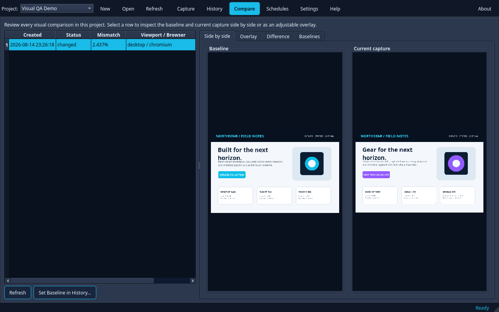
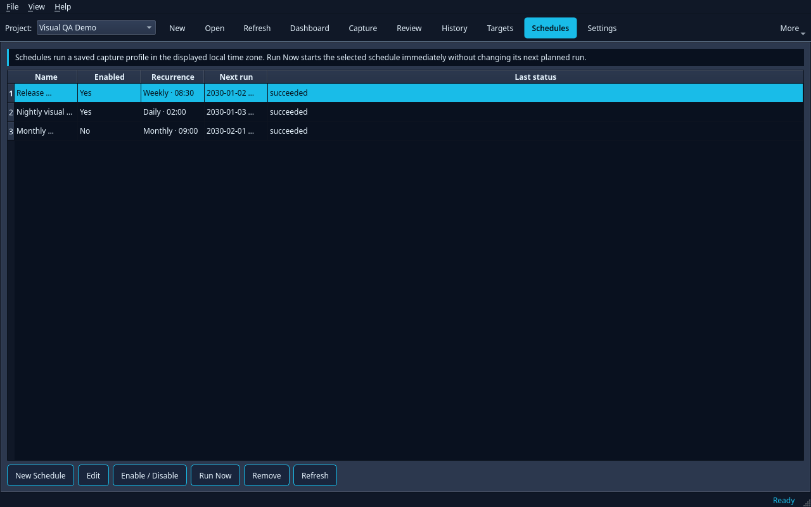

<div align="center">
  
  <h1>CyberSnapper</h1>
  <p><strong>Capture every viewport. Catch every change.</strong></p>
  <p>Native website capture and visual regression for macOS, Windows, and Linux.</p>

  <p>
    <a href="https://github.com/Alex9001/CyberSnapper/actions/workflows/ci.yml"></a>
    <a href="https://github.com/Alex9001/CyberSnapper/releases/latest"></a>
    <a href="LICENSE"></a>
  </p>

  <p>
    <a href="https://alex9001.github.io/CyberSnapper/"><strong>Explore the website</strong></a>
    ·
    <a href="https://github.com/Alex9001/CyberSnapper/releases/latest"><strong>Download CyberSnapper</strong></a>
    ·
    <a href="docs/BUILDING.md"><strong>Build from source</strong></a>
  </p>
</div>


CyberSnapper is a local-first visual QA studio. Define a capture once, reuse it from the native Qt interface, CLI, scheduler, or authenticated localhost API, and keep every artifact in a portable project folder you control.

It is not a web UI wrapped in a desktop shell. The interface is native Qt Widgets; a private Playwright worker exists only to drive browser captures.

## Download

CyberSnapper 2.1 packages bundle the application, Qt runtime, Node runtime, capture worker, and Chromium. Firefox and WebKit can be installed on demand from Settings.

| Platform | Package |
| --- | --- |
| macOS · Apple silicon | [CyberSnapper-macos-arm64.zip](https://github.com/Alex9001/CyberSnapper/releases/download/v2.1.0/CyberSnapper-macos-arm64.zip) |
| macOS · Intel | [CyberSnapper-macos-x64.zip](https://github.com/Alex9001/CyberSnapper/releases/download/v2.1.0/CyberSnapper-macos-x64.zip) |
| Windows · x64 | [CyberSnapper-windows-x64.zip](https://github.com/Alex9001/CyberSnapper/releases/download/v2.1.0/CyberSnapper-windows-x64.zip) |
| Linux · x64 | [CyberSnapper-linux-x64.tar.gz](https://github.com/Alex9001/CyberSnapper/releases/download/v2.1.0/CyberSnapper-linux-x64.tar.gz) |

Every release includes SHA-256 checksums and GitHub build-provenance attestations. macOS archives are ad-hoc signed and Windows archives are currently unsigned; see the [packaging notes](docs/BUILDING.md#packages).

## Why CyberSnapper

- Capture desktop, tablet, mobile, and custom viewports with explicit pixel ratio and mobile-mode controls.
- Run Chromium, Firefox, and WebKit across full-page, viewport, or CSS-element captures.
- Export PNG, WebP, AVIF, and Chromium PDF with collision-safe output naming.
- Save trusted visual baselines and review changes side by side, overlaid, or as a generated diff.
- Control pixel sensitivity, allowed mismatch, and dynamic-element exclusion per profile.
- Schedule once, interval, daily, weekly, or monthly runs in real IANA time zones.
- Share one durable job queue and project history across the GUI, CLI, scheduler, and REST API.
- Move or archive a project as one normal folder containing its manifest, captures, baselines, diffs, and SQLite state.

## A complete visual workflow

| History | Compare |
| --- | --- |
| Filter every run, see partial failures, open artifacts, retry jobs, and promote a result to baseline. | Inspect baseline and current captures side by side, overlay them, or view the generated difference image. |
|  |  |

Saved profiles also power persistent local-time schedules that can be run immediately or recur without keeping the main window open.



The screenshots above are generated automatically from a deterministic demo project. They contain no live or customer data. Regenerate them with `npm run screenshots:docs` after building the native test targets.

## How it fits together

```text
Native Qt GUI ─┐
CLI ───────────┼── private framed JSON RPC ── Agent ── portable SQLite project
REST v1 ───────┘                                │         captures / baselines / diffs
                                               ├── scheduler + durable job queue
                                               └── NDJSON ── Playwright worker ── browsers
```

The API is disabled by default, binds only to `127.0.0.1`, and stores only the SHA-256 digest of its generated bearer token. Navigation policy rejects non-HTTP protocols and embedded credentials, keeps private LAN destinations blocked, makes localhost a per-project opt-in, and resolves/pins outbound destinations so redirects and subresources cannot bypass the policy.

Read the deeper guides:

- [Architecture and security boundaries](docs/ARCHITECTURE.md)
- [Portable project format](docs/PROJECT_FORMAT.md)
- [REST API v1](docs/API.md)
- [Building and packaging](docs/BUILDING.md)

## Build from source

You need CMake 3.24+, a C++20 compiler, Qt 6.8+ (`Core`, `Gui`, `Widgets`, `Network`, `Sql`, `Svg`, and `Test`), Node.js 20+, and npm.

```bash
npm install
npm run typecheck:worker
npm run build:worker
npm run test:worker

cmake -S . -B build/native -DCMAKE_BUILD_TYPE=Release
cmake --build build/native --parallel
ctest --test-dir build/native --output-on-failure
```

Development binaries land in `build/native/native/`:

```bash
build/native/native/CyberSnapper
build/native/native/cybersnapper-cli agent status
build/native/native/cybersnapper-cli capture https://example.com
```

Install Chromium into the development browser cache with `npx playwright install chromium`, or install engines from the application’s Settings page.

## CLI in thirty seconds

```bash
# Capture two sites and wait for completion
cybersnapper-cli capture https://example.com https://example.org

# Batch targets, engines, and formats with a JSON result
cybersnapper-cli capture --file urls.txt \
  --engine chromium --engine firefox \
  --format png --format webp --json

cybersnapper-cli jobs --limit 25
cybersnapper-cli job show JOB_ID --json
cybersnapper-cli job retry JOB_ID
cybersnapper-cli schedules list
cybersnapper-cli schedules run SCHEDULE_ID
```

Press Ctrl+C while waiting to request cancellation, or add `--no-wait` to return as soon as the job is queued.

## REST API

Enable the local API in Settings or with `cybersnapper-cli api enable`, then keep the one-time token somewhere safe.

```bash
curl -H "Authorization: Bearer $TOKEN" \
  -H 'Content-Type: application/json' \
  -d '{"urls":["https://example.com"],"profileId":"default"}' \
  http://127.0.0.1:39071/api/v1/jobs
```

The API supports capture submission, job inspection and cancellation, project discovery, and resumable server-sent job events. See [REST API v1](docs/API.md) for the full contract.

## CyberSnapper 1.x archive

CyberSnapper 2 is a clean break from the original script. It does not import, read, or depend on 1.x state, and no migration path is required. The final 1.x source and downloadable archive remain frozen in the [v1.0.0 release](https://github.com/Alex9001/CyberSnapper/releases/tag/v1.0.0) for anyone who still needs them.

## License

CyberSnapper is open source under the [ISC license](LICENSE). Qt, Playwright, Chromium, and other packaged dependencies retain their own licenses.
