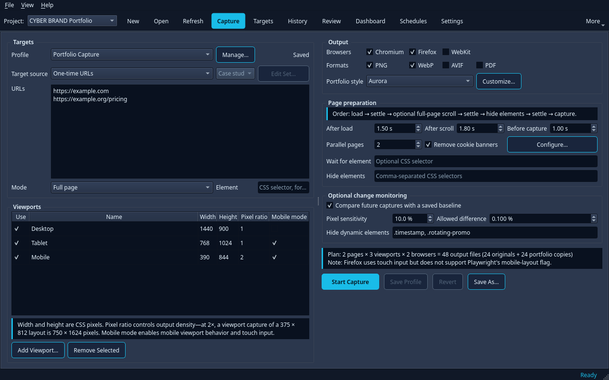
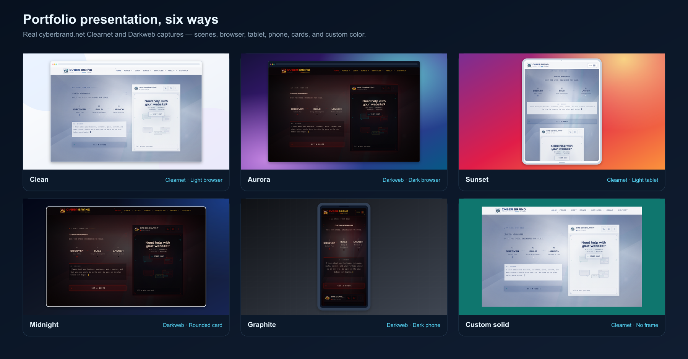
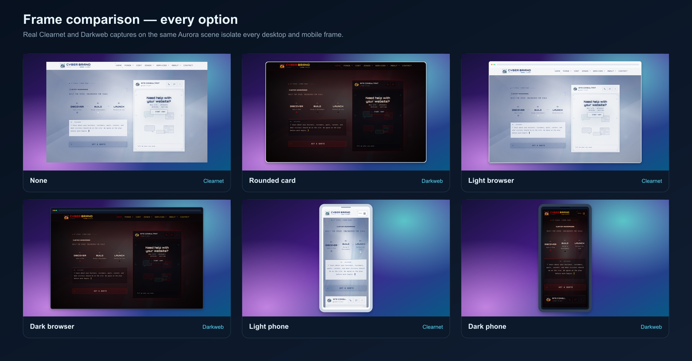
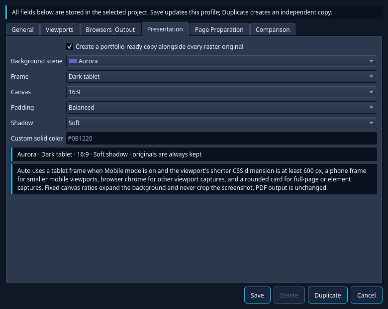
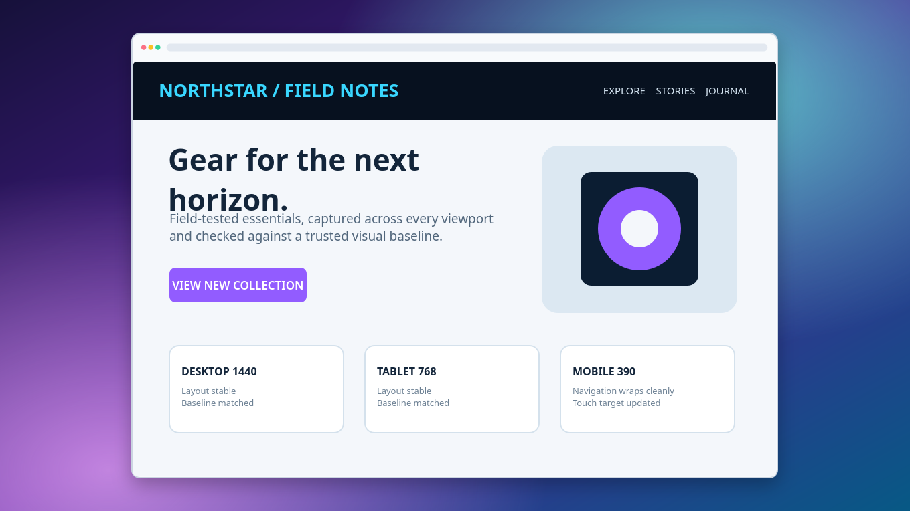
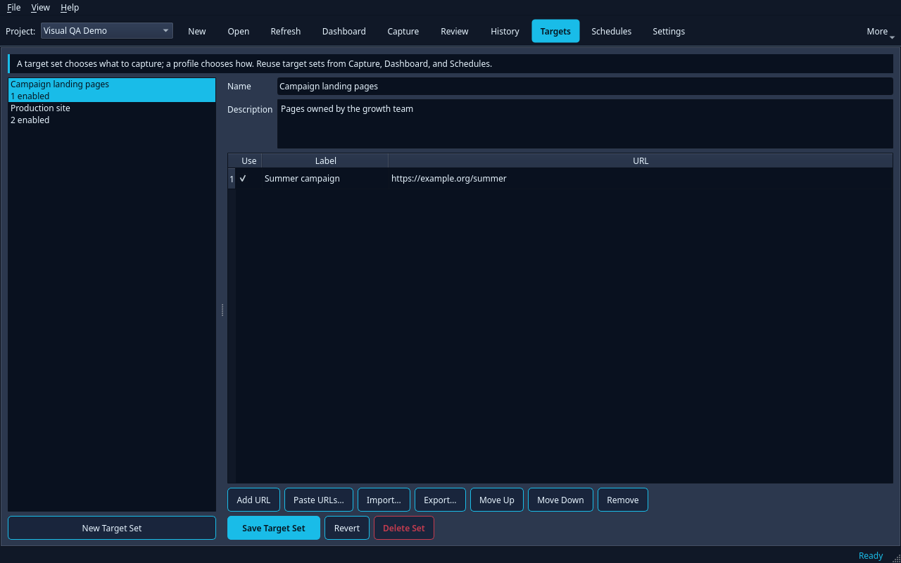
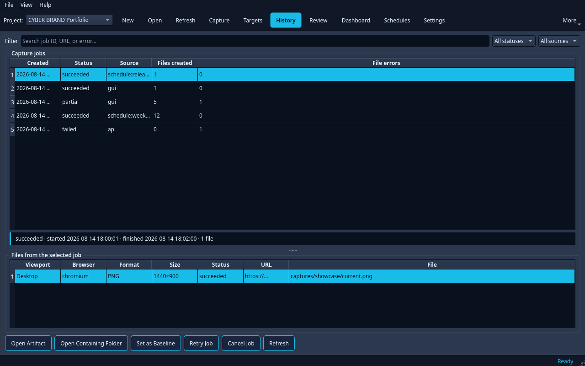
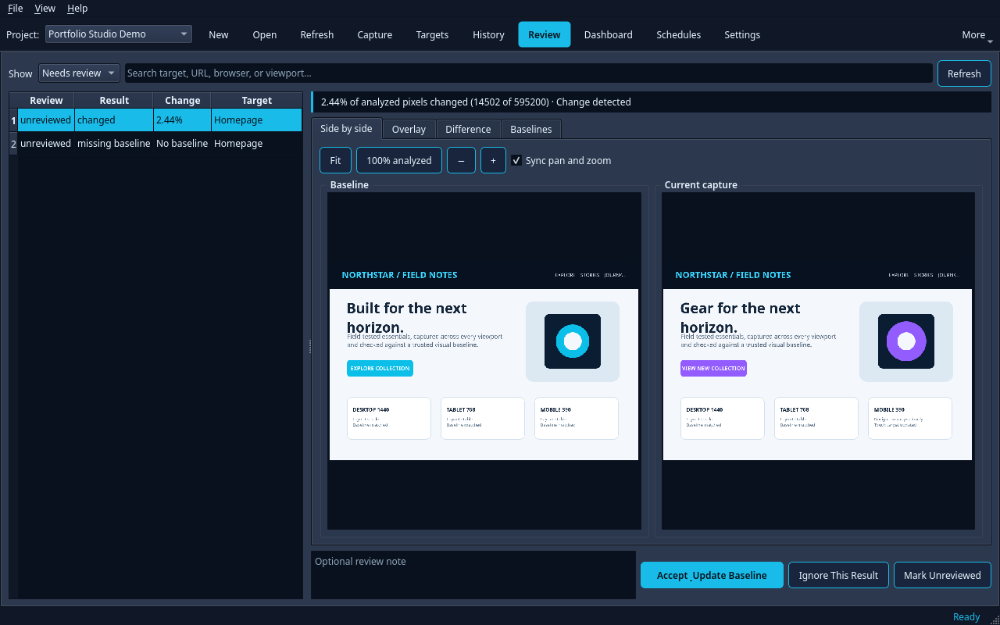

<div align="center">
  
  <h1>CyberSnapper</h1>
  <p><strong>Capture your work. Build your portfolio.</strong></p>
  <p>Native website screenshot capture for macOS, Windows, and Linux.</p>

  <p>
    <a href="https://github.com/Alex9001/CyberSnapper/actions/workflows/ci.yml"></a>
    <a href="https://github.com/Alex9001/CyberSnapper/releases/latest"></a>
    <a href="LICENSE"></a>
  </p>

  <p>
    <a href="https://alex9001.github.io/CyberSnapper/"><strong>Explore the website</strong></a>
    ·
    <a href="https://github.com/Alex9001/CyberSnapper/releases/latest"><strong>Download CyberSnapper</strong></a>
    ·
    <a href="docs/BUILDING.md"><strong>Build from source</strong></a>
  </p>
</div>



CyberSnapper is a local-first screenshot studio for designers and developers who need polished images of their websites. Give it one project or an entire portfolio, choose the exact desktop, tablet, and mobile views, and create a consistent set of full-page, viewport, or element screenshots in one run.

The finished files are normal PNG, WebP, AVIF, or PDF files in a portable folder you control. It is not a web UI wrapped in a desktop shell: the interface is native Qt Widgets, and a private Playwright worker exists only to render and capture your pages.

## Download

CyberSnapper 2.2 is the current development line. The latest published 2.1 packages bundle the application, Qt runtime, Node runtime, capture worker, and Chromium. Firefox and WebKit can be installed on demand from Settings.

| Platform | Package |
| --- | --- |
| macOS · Apple silicon | [CyberSnapper-macos-arm64.zip](https://github.com/Alex9001/CyberSnapper/releases/download/v2.1.0/CyberSnapper-macos-arm64.zip) |
| macOS · Intel | [CyberSnapper-macos-x64.zip](https://github.com/Alex9001/CyberSnapper/releases/download/v2.1.0/CyberSnapper-macos-x64.zip) |
| Windows · x64 | [CyberSnapper-windows-x64.zip](https://github.com/Alex9001/CyberSnapper/releases/download/v2.1.0/CyberSnapper-windows-x64.zip) |
| Linux · x64 | [CyberSnapper-linux-x64.tar.gz](https://github.com/Alex9001/CyberSnapper/releases/download/v2.1.0/CyberSnapper-linux-x64.tar.gz) |

Every release includes SHA-256 checksums and GitHub build-provenance attestations. macOS archives are ad-hoc signed and Windows archives are currently unsigned; see the [packaging notes](docs/BUILDING.md#packages).

## Built for portfolio screenshots

- Capture full scrolling pages, exact viewports, or one CSS-selected element.
- Produce desktop, tablet, mobile, and custom-sized images together with explicit pixel density and mobile-browser controls.
- Wait for pages to settle, block common overlays, and hide chosen elements so banners and animation do not spoil the shot.
- Create portfolio-ready copies with Clean, Aurora, Sunset, Midnight, Graphite, or custom-solid scenes; add browser, phone, or rounded-card frames; and target 16:9, 4:3, square, or content-fit canvases.
- Save labeled target sets for all the projects and pages in a portfolio, then recapture them as one batch.
- Export PNG, WebP, AVIF, and Chromium PDF with collision-safe names into ordinary folders.
- Render through Chromium, Firefox, or WebKit and keep a searchable history of every resulting file.

Visual comparison, baselines, recurring schedules, retries, the native CLI, and the authenticated localhost API are optional power tools. They support larger workflows without redefining the application’s primary job: making portfolio-ready website screenshots.

## Portfolio presentation scenes

Turn on **Portfolio style** to save two files for each raster capture: the untouched original and a polished `-portfolio` copy. Scenes and frames are rendered locally with vector graphics—there is no upload, account, template service, or downloaded mockup pack.

- Backgrounds: Clean, Aurora, Sunset, Midnight, Graphite, and a custom `#RRGGBB` solid color.
- Frames: automatic, none, rounded card, light/dark browser, and light/dark phone.
- Canvases: fit content, 16:9, 4:3, and square, with compact, balanced, or generous padding.
- Shadows: none, soft, or strong.

Automatic framing understands the capture: mobile viewports receive a phone frame, desktop viewports receive browser chrome, and full-page or element captures receive a rounded card. Fixed ratios only expand the background—they never crop or upscale the screenshot. Original files remain the source for visual comparison.



### Frame comparison

These are the actual six explicit frame choices. **Auto** selects among them based on the capture: browser chrome for desktop viewports, phone hardware for mobile viewports, and a rounded card for full-page or element captures.



| Presentation settings | Finished `-portfolio` file |
| --- | --- |
| The complete profile editor makes every choice explicit and explains automatic framing. | This 16:9 Aurora scene and browser frame came directly from the production renderer. |
|  |  |

The application and output images above are generated automatically by `npm run screenshots:docs`, using the same Qt interface and Sharp renderer that ship with CyberSnapper.

## The portfolio capture workflow

| Capture | Targets |
| --- | --- |
| Combine one-time URLs or a saved project set with exact viewports, capture modes, browsers, formats, and page clean-up rules. | Maintain labeled portfolio projects with paste, TXT/CSV import and export, ordering, and per-page enable controls. |
|  |  |

| History | Optional Review |
| --- | --- |
| Find completed runs, open their screenshot files, retry a batch, and see exactly what succeeded. | When monitoring a live project, compare revisions with synchronized pan/zoom, overlay, wipe, and generated differences. |
|  |  |

The Dashboard and Schedules pages summarize background activity for people who use those optional workflows; neither is required to capture a portfolio.

The screenshots above are generated automatically from a deterministic demo project. They contain no live or customer data. Regenerate them with `npm run screenshots:docs` after building the native test targets.

## How it fits together

```text
Native Qt GUI ─┐
CLI ───────────┼── private framed JSON RPC ── Agent ── portable SQLite project
REST v1 ───────┘                                │         captures / baselines / diffs
                                               ├── scheduler + durable job queue
                                               └── NDJSON ── Playwright worker ── browsers
```

The API is disabled by default, binds only to `127.0.0.1`, and stores only the SHA-256 digest of its generated bearer token. Navigation policy rejects non-HTTP protocols and embedded credentials, keeps private LAN destinations blocked, makes localhost a per-project opt-in, and resolves/pins outbound destinations so redirects and subresources cannot bypass the policy.

Read the deeper guides:

- [Architecture and security boundaries](docs/ARCHITECTURE.md)
- [Portable project format](docs/PROJECT_FORMAT.md)
- [REST API v1](docs/API.md)
- [Building and packaging](docs/BUILDING.md)

## Build from source

You need CMake 3.24+, a C++20 compiler, Qt 6.8+ (`Core`, `Gui`, `Widgets`, `Network`, `Sql`, `Svg`, and `Test`), Node.js 20+, and npm.

```bash
npm install
npm run typecheck:worker
npm run build:worker
npm run test:worker

cmake -S . -B build/native -DCMAKE_BUILD_TYPE=Release
cmake --build build/native --parallel
ctest --test-dir build/native --output-on-failure
```

Development binaries land in `build/native/native/`:

```bash
build/native/native/CyberSnapper
build/native/native/cybersnapper-cli agent status
build/native/native/cybersnapper-cli capture https://example.com
```

Install Chromium into the development browser cache with `npx playwright install chromium`, or install engines from the application’s Settings page.

## CLI in thirty seconds

```bash
# Capture two sites and wait for completion
cybersnapper-cli capture https://example.com https://example.org

# Batch targets, engines, and formats with a JSON result
cybersnapper-cli capture --file urls.txt \
  --engine chromium --engine firefox \
  --format png --format webp --json

# Reuse a saved target set and triage its results
cybersnapper-cli targets list --json
cybersnapper-cli capture --target-set TARGET_SET_ID --json
cybersnapper-cli review list --json
cybersnapper-cli review accept COMPARISON_ID --revision 0

cybersnapper-cli jobs --limit 25
cybersnapper-cli job show JOB_ID --json
cybersnapper-cli job retry JOB_ID
cybersnapper-cli schedules list
cybersnapper-cli schedules run SCHEDULE_ID
```

Press Ctrl+C while waiting to request cancellation, or add `--no-wait` to return as soon as the job is queued.

## REST API

Enable the local API in Settings or with `cybersnapper-cli api enable`, then keep the one-time token somewhere safe.

```bash
curl -H "Authorization: Bearer $TOKEN" \
  -H 'Content-Type: application/json' \
  -d '{"urls":["https://example.com"],"profileId":"default"}' \
  http://127.0.0.1:39071/api/v1/jobs
```

The API supports target sets, dashboard summaries, capture submission, job inspection, comparison review, project discovery, and resumable server-sent job events. See [REST API v1](docs/API.md) for the full contract.

## CyberSnapper 1.x archive

CyberSnapper 2 is a clean break from the original script. It does not import, read, or depend on 1.x state, and no migration path is required. The final 1.x source and downloadable archive remain frozen in the [v1.0.0 release](https://github.com/Alex9001/CyberSnapper/releases/tag/v1.0.0) for anyone who still needs them.

## License

CyberSnapper is open source under the [ISC license](LICENSE). Qt, Playwright, Chromium, and other packaged dependencies retain their own licenses.
